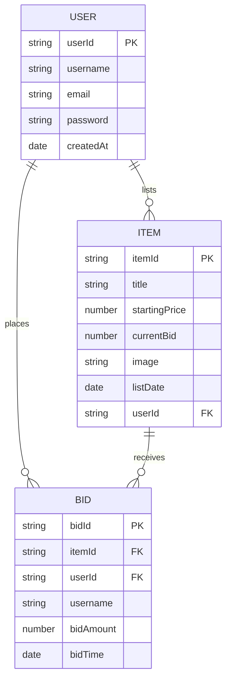

## Entity-Relationship Diagram for Auction Platform

### Relationships Explained:
- A User can list multiple Items
- A User can place multiple Bids
- An Item can receive multiple Bids
- Each Bid is associated with a specific Item and User

### Cardinality:
- One User can have zero or many Items (||--o{)
- One User can have zero or many Bids (||--o{)
- One Item can have zero or many Bids (||--o{)
